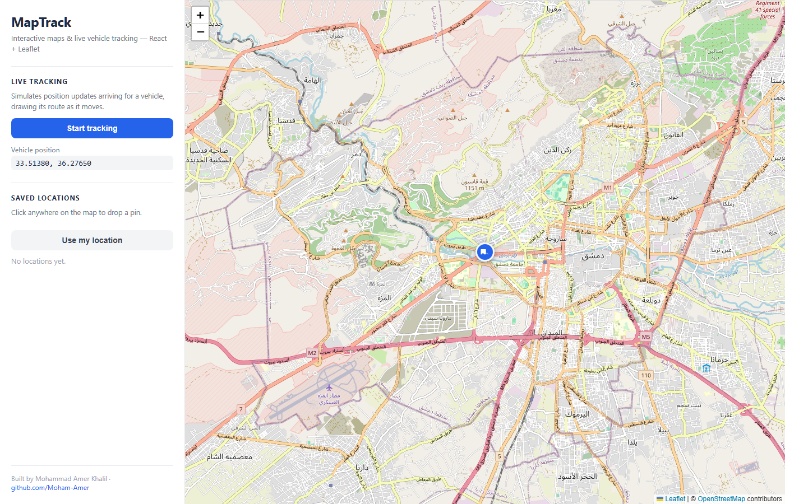

# TrackerAid

An interactive map with live vehicle tracking, built with React and Leaflet.

**Live demo:** _(add link)_



## Features

- Interactive map using OpenStreetMap tiles
- Click anywhere on the map to drop a pin and capture its coordinates
- Saved locations list, click a point to fly to it or remove it
- "Use my location" using the browser Geolocation API
- Live tracking: a vehicle moves along a route, draws the path it covered, and its coordinates update as it goes

## Built with

- React 19 + Vite
- react-leaflet / Leaflet for the map (tile layer, markers, polyline, map events)
- `useMapEvents` for map clicks and `useMap` with `flyTo` for moving the map
- Custom `DivIcon` markers, since Leaflet's default image icons don't load properly under Vite
- The tracking loop runs in `setInterval` inside `useEffect`, cleared on unmount so it doesn't keep running

## About the tracking data

The route is a list of coordinates in `src/route.js` that the app steps through on a timer. In a real fleet tracking system the positions would come from the server over WebSocket or polling — the map and rendering side stays the same, only the data source changes.

## Running it

```bash
npm install
npm run dev
```

`npm run build` for a production build.
